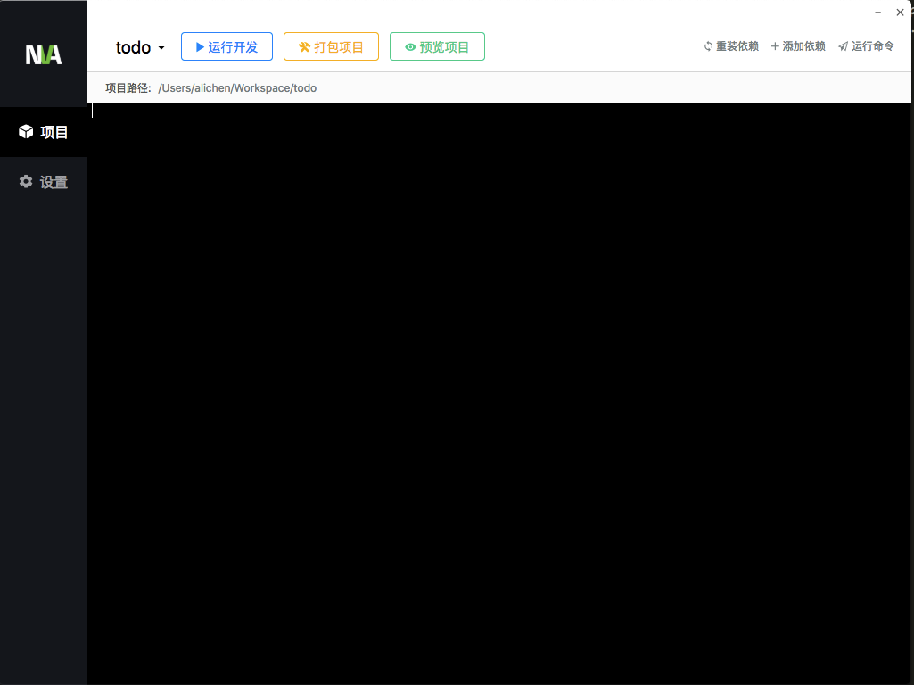

nva-client
===

gui client for [nva](https://github.com/ali322/nva) cli, no environment pre-requirements

## Snapshot

## Installation
Download from [GitHub Releases](./releases) and install it.

## Documentation

more documentation please go to [nva.js.org](http://nva.js.org)

## Contribution

welcome to pull request and issues,help to improve `nva` better 

## License

[MIT License](http://en.wikipedia.org/wiki/MIT_License)