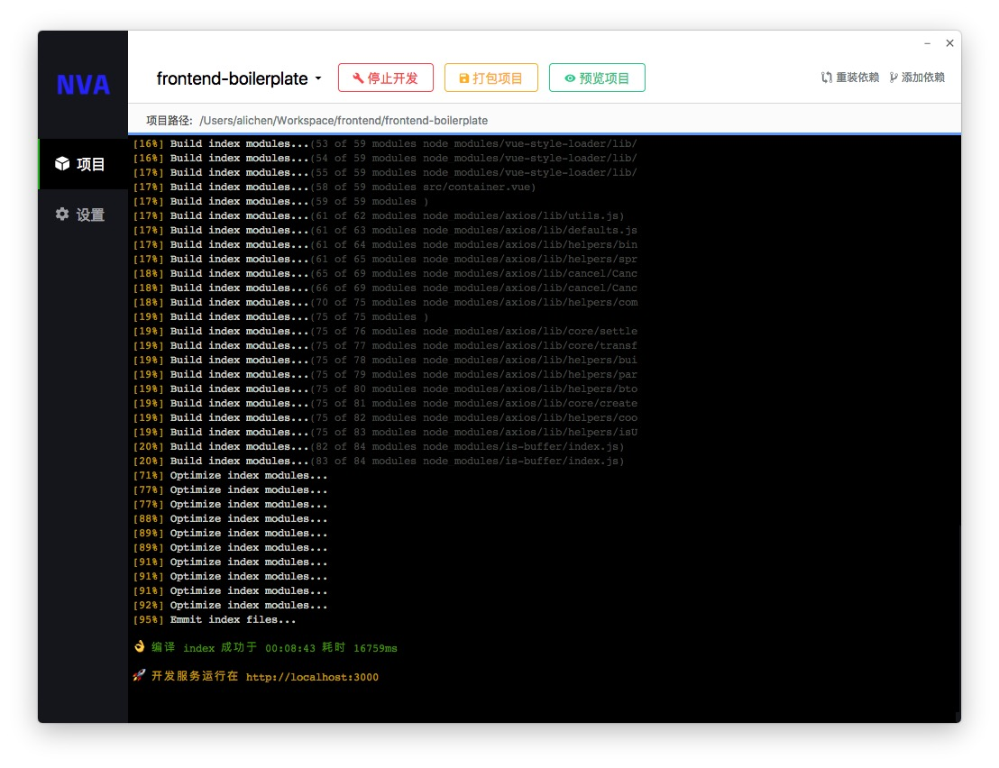

nva-client
===

[nva](https://github.com/ali322/nva) 命令行的客户端, 零环境依赖

简体中文 | [English](./README.md)

## 快照

## 安装
从 [GitHub Releases](https://github.com/ali322/nva-client/releases) 下载然后安装即可.

## Documentation

更多文档请前往 [nva.js.org](http://nva.js.org)

## 贡献

欢迎 PR 和 Issues, 帮助我们将 `nva` 变得更好用 

## License

[MIT License](http://en.wikipedia.org/wiki/MIT_License)
